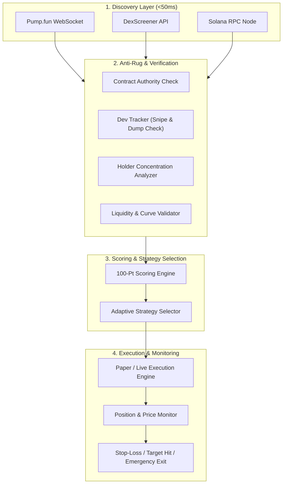

# ⚡ Solana Memecoin Trading Bot & Anti-Rug Sniper

[](https://solana.com/)
[](https://fastapi.tiangolo.com/)
[](https://react.dev/)
[](https://vitejs.dev/)
[](https://www.typescriptlang.org/)
[](https://opensource.org/licenses/MIT)

An enterprise-grade, high-frequency **Solana Memecoin Trading Bot & Anti-Rug Engine** designed for sub-second discovery, deep on-chain security verification, composite scoring, multi-strategy execution, and real-time portfolio monitoring on **Pump.fun**, **Raydium**, **Orca**, and **Meteora**.

---

## 📸 System Overview

```
┌────────────────────────────────────────────────────────────────────────────────────────┐
│                                REAL-TIME PIPELINE                                     │
├─────────────────┬──────────────────┬─────────────────┬─────────────────┬──────────────┤
│ 1. DISCOVERY    │ 2. ANTI-RUG & SEC│ 3. SCORING      │ 4. ADAPTIVE EXE │ 5. MONITOR   │
├─────────────────┼──────────────────┼─────────────────┼─────────────────┼──────────────┤
│ • Pump.fun WS   │ • Mint / Freeze  │ • Security 30%  │ • Fast Scalper  │ • Real Price │
│ • DexScreener   │ • Dev Snipe <5%  │ • Liquidity 20% │ • Momentum 3-T  │ • Stop-Loss  │
│ • Solana RPC    │ • Dump Detection │ • Holders 20%   │ • Smart-Wallet  │ • Trail Stop │
│ (<50ms latency) │ • Top10 Concen.  │ • Dev Track 15% │ • Jupiter Swap  │ • Auto-Exit  │
└─────────────────┴──────────────────┴─────────────────┴─────────────────┴──────────────┘
```

---

## ✨ Core Features

### 1. ⚡ High-Speed Multi-Source Discovery
* **Pump.fun Live WebSocket (`wss://pumpportal.fun/api/data`)**: Streams newly minted tokens in $<50\text{ms}$ directly from bonding curves.
* **DexScreener API Integration**: Discovers pairs across Raydium (AMM v4, CPMM, CLMM), Orca, and Meteora.
* **Solana RPC Polling**: Fallback block scanner and signature tracker.

### 2. 🛡️ Multi-Layered Anti-Rug Shield
* **Developer Snipe Detection**: Extracts deployer wallet (`traderPublicKey`) and launch buy amount (`initialBuy`). Rejects any token where creator holds $>5\%$ of initial supply.
* **Creator Dump Protection**: Tracks live dev transactions. Any dev selling triggers instant disqualification (`Score 0`).
* **Contract Security Checks**: Verifies `mint_authority == None`, `freeze_authority == None`, and inspects Token-2022 extensions for transfer hooks/fees.
* **Holder Distribution Analysis**: Flags insider wallet clusters and dangerous top-10 concentration ($>25\%$).
* **Liquidity Lock Verification**: Validates Raydium / Pump.fun virtual bonding reserves ($\ge \$1,000$).

### 3. 🎯 100-Point Composite Scoring Engine
Scores each token across 6 quantitative pillars:
* **Contract Security (30 pts)**
* **Liquidity & Lock (20 pts)**
* **Holder Distribution (20 pts)**
* **Developer Track Record (15 pts)**
* **Social & Community Verification (10 pts)**
* **Market Behavior & Momentum (5 pts)**

### 4. 🧠 Adaptive Multi-Strategy Engine
* **⚡ Fast Scalper**: Sub-second entry on fresh bonding curves with single-target $+10\%$ NET auto-exit.
* **📈 Momentum Runner**: 3-Tier partial profit taking ($+10\% / +25\% / +50\%$) combined with a $15\%$ trailing stop.
* **🕵️ Smart-Wallet Follower**: Tracks whale cluster entries and exits in tandem with profitable historical wallets.

### 5. 📊 Real-Time Cyberpunk Dashboard
* High-performance **React 18 + Vite + TypeScript** interface.
* Live WebSocket telemetry, active position PnL, recent candidate evaluation audits, trade execution logs, and risk limits.

---

## 🏗️ Architecture



---

## 🚀 Quick Start

### Prerequisites
* **Python 3.11+** (Python 3.12 recommended)
* **Node.js 18+** & `npm`
* **Solana RPC Endpoint** (Mainnet or QuickNode/Helius/Alchemy)

### 1. Clone the Repository
```bash
git clone https://github.com/Atef-AK/MEMECOIN-BOT.git
cd MEMECOIN-BOT
```

### 2. Configure Environment Variables
Copy `.env.example` to `.env`:
```bash
cp .env.example .env
```
Key configuration options:
```env
# Mode Selection (PAPER or LIVE)
PAPER_TRADING=true
LIVE_TRADING=false

# Strategy & Risk
POSITION_SIZE_SOL=0.10
STARTING_PAPER_CAPITAL_SOL=5.0
NET_TARGET_PERCENT=10
MIN_SCORE=68

# RPC & Execution
RPC_URL=https://api.mainnet-beta.solana.com
JUPITER_API_URL=https://api.jup.ag/swap/v2
```

### 3. Setup & Start Backend
```bash
# Install Python dependencies
pip install -r pyproject.toml
# Or using pip with dependencies:
pip install fastapi uvicorn httpx pydantic sqlalchemy aiosqlite websockets solders solana

# Run FastAPI Backend Server
python -m backend.main
```
Backend runs at `http://localhost:8000`.

### 4. Setup & Start Frontend Dashboard
```bash
cd frontend
npm install
npm run dev
```
Dashboard opens at `http://localhost:5173`.

---

## 📁 Repository Structure

```
├── backend/
│   ├── adaptive/         # Multi-strategy intelligence & regime detection
│   ├── api/              # FastAPI REST endpoints & WebSocket handlers
│   ├── config/           # App settings & environment validation
│   ├── database/         # SQLAlchemy ORM models, session & repository
│   ├── devtracker/       # Creator wallet graph & dump detection
│   ├── discovery/        # Pump.fun WS, DexScreener & RPC scanners
│   ├── execution/        # Jupiter swap client & paper trade simulator
│   ├── holders/          # Holder distribution & top-10 concentration
│   ├── liquidity/        # Liquidity pool & virtual curve analyzers
│   ├── models/           # Pydantic schemas (Token, Trade, Score)
│   ├── monitoring/       # Real-time position monitor & price polling
│   ├── scoring/          # 100-point composite scoring engine
│   ├── security/         # Mint/freeze authority & Token-2022 inspector
│   └── strategy/         # Main orchestrator & lifecycle manager
├── frontend/
│   ├── src/
│   │   ├── App.tsx       # Real-time cyberpunk dashboard
│   │   ├── api.ts        # REST & WebSocket client
│   │   └── main.tsx      # React entrypoint
├── .env.example          # Environment variable template
├── .gitignore            # Sensitive data & build artifact exclusions
├── Dockerfile            # Container definition
├── docker-compose.yml    # Full-stack container orchestration
└── README.md             # Project documentation
```

---

## 🔒 Security & Safety Controls

* **Zero Hardcoded Secrets**: All API keys, wallets, and endpoints are loaded strictly from environment variables.
* **Paper-First Architecture**: Default configuration runs in 100% simulated `PAPER` mode.
* **Automatic Stop-Loss**: Built-in $-15\%$ stop-loss and trailing-stop profit lock-in.
* **Kill-Switch**: One-click REST/WebSocket trigger immediately freezes discovery and liquidates active positions.
* **Risk Manager**: Caps maximum daily drawdown ($25\%$) and consecutive losses ($10$).

---

## 📜 Disclaimer

This software is for **educational and research purposes only**. Cryptocurrency trading involves substantial risk of loss. Never trade with funds you cannot afford to lose. The authors assume no responsibility for financial losses incurred through the use of this software.

---

## 📄 License

This project is licensed under the **MIT License** — see the [LICENSE](LICENSE) file for details.
